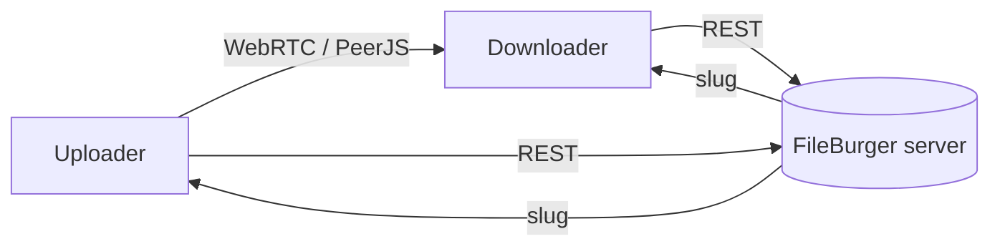
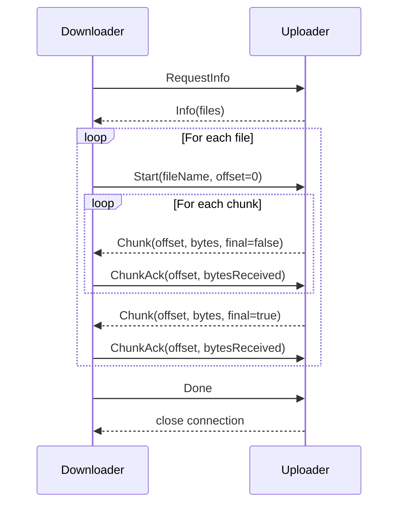
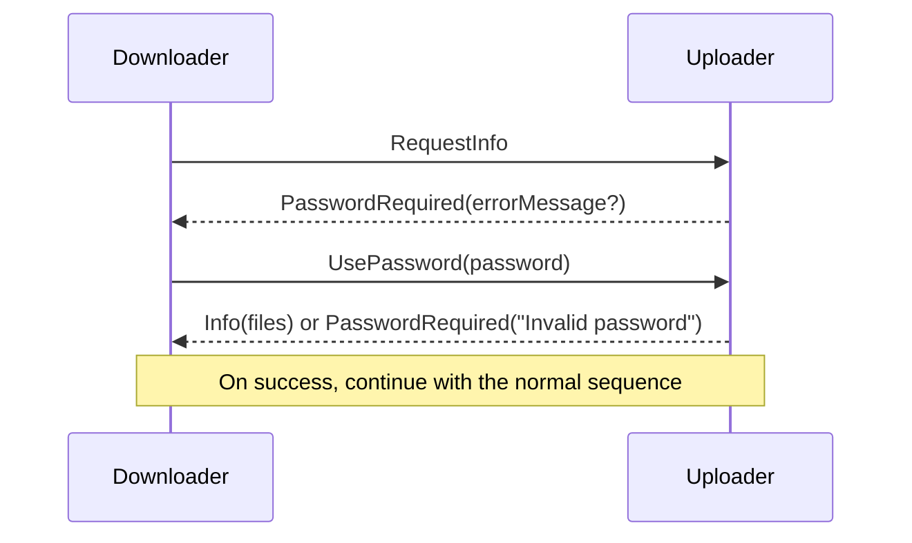
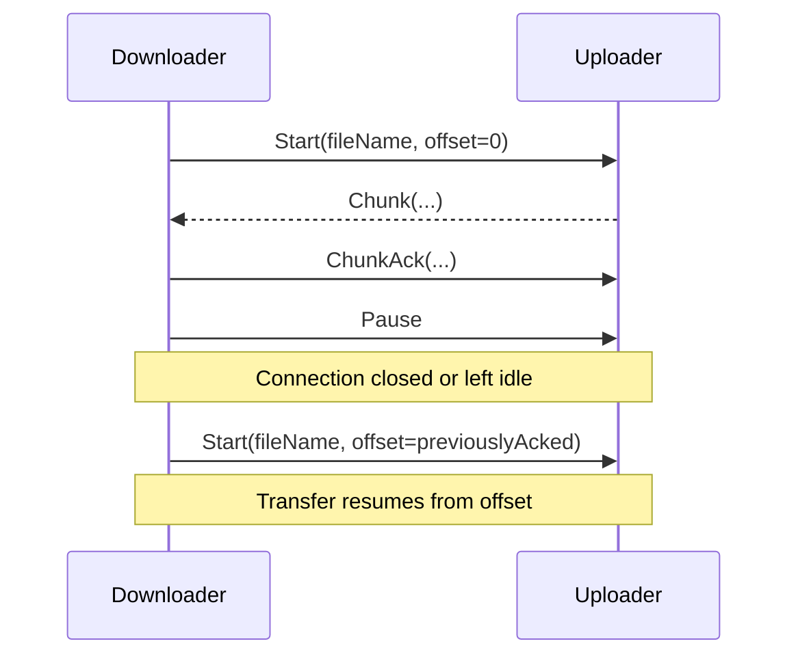
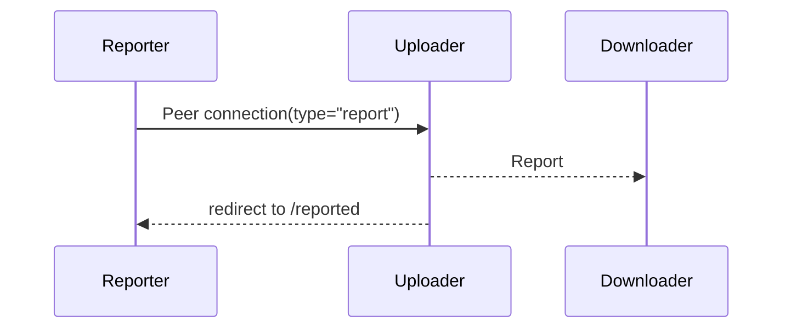

# FileBurger transfer protocol

The message-based protocol FileBurger uses to move a file straight from one
browser to another over a WebRTC data channel. This is enough to implement
either half — uploader or downloader — against FileBurger, or to adapt the
design to something else entirely.

The wire format is inherited from [FilePizza][filepizza] and is unchanged, so
a FileBurger peer can talk to a FilePizza peer.

[filepizza]: https://github.com/kern/filepizza

## Architecture



1. The uploader creates a channel and receives slugs that encode its PeerJS ID.
2. The downloader resolves the slug to the uploader's PeerJS ID.
3. Everything after that travels peer-to-peer over a reliable data channel.

The server is only a directory. It never sees file contents.

## Messages

Every message is JSON with a `type` field. Fields marked `?` are optional.
Schemas live in `src/messages.ts` and are validated with zod on receipt, so a
malformed message is dropped rather than acted on.

```mermaid
classDiagram
    class RequestInfo {
        +"RequestInfo" type
        +string browserName
        +string browserVersion
        +string osName
        +string osVersion
        +string mobileVendor
        +string mobileModel
    }
    class Info {
        +"Info" type
        +FileInfo[] files
    }
    class FileInfo {
        +string fileName
        +number size
        +string type
    }
    class Start {
        +"Start" type
        +string fileName
        +number offset
    }
    class Chunk {
        +"Chunk" type
        +string fileName
        +number offset
        +ArrayBuffer bytes
        +boolean final
    }
    class ChunkAck {
        +"ChunkAck" type
        +string fileName
        +number offset
        +number bytesReceived
    }
    class Pause {
        +"Pause" type
    }
    class Done {
        +"Done" type
    }
    class Error {
        +"Error" type
        +string error
    }
    class PasswordRequired {
        +"PasswordRequired" type
        +string errorMessage?
    }
    class UsePassword {
        +"UsePassword" type
        +string password
    }
    class Report {
        +"Report" type
    }
```



Chunks are at most 256 KiB (`MAX_CHUNK_SIZE` in
`src/hooks/useUploaderConnections.ts`). `final` marks the last piece of a file.

## Normal transfer



Note the ack loop. The uploader does not run ahead: it sends a chunk, waits for
the downloader to acknowledge, then sends the next. That is what makes the
progress bar honest, and it is also natural backpressure.

## Password-protected transfers



`PasswordRequired` without an `errorMessage` is the initial challenge. With one
it is a rejection, and the downloader stays on the password screen.

## Pause and resume

A downloader can pause mid-file. To resume it reconnects and asks for the rest
of the file from the last acknowledged offset.



Resume is stateless: the uploader does not track a session, it just honours
whatever `offset` arrives in `Start`. That is also why the uploader validates
that the offset is within the file before serving it.

## Reporting

A PeerJS connection opened with metadata `{ type: "report" }` tells the
uploader to call off the order. The uploader broadcasts `Report` to every
connected downloader (so nobody is left mid-transfer with a dead link) and
redirects itself to `/reported`.



The reporter also calls `POST /api/destroy` with the slug, which invalidates
the link entirely. That endpoint is deliberately unauthenticated — holding the
slug is the authorisation, which is what lets a third party call off an order.

## Worked examples

### Single file, no password

```
RequestInfo
Info [{ fileName: "photo.jpg", size: 1048576, type: "image/jpeg" }]
Start { fileName: "photo.jpg", offset: 0 }
Chunk { offset: 0, bytes: <256 KB>, final: false }
ChunkAck { offset: 0, bytesReceived: 262144 }
...
Chunk { offset: 1048576, bytes: <0>, final: true }
ChunkAck { offset: 1048576, bytesReceived: 0 }
Done
```

### Password-protected

```
RequestInfo
PasswordRequired
UsePassword { password: "secret" }
Info [...]
...
```

### Resuming after an interruption

```
RequestInfo
Info [...]
Start { fileName: "video.mp4", offset: 0 }
Chunk/ChunkAck exchanges...
<connection drops after 1 MB>
Start { fileName: "video.mp4", offset: 1048576 }
Chunk/ChunkAck exchanges...
Done
```

## Notes for implementers

- **Validate every message.** A peer can send anything. `decodeMessage` in
  `src/messages.ts` is the choke point.
- **Acks are load-bearing.** Without them the sender will happily fill the
  channel buffer and the progress bar will lie.
- **Chunk boundaries need not align with anything.** The downloader appends
  whatever arrives at the given offset.
- **`Done` closes the connection.** The uploader treats it as final and stops.
